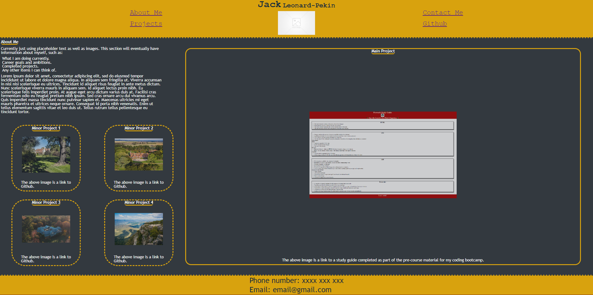

# My_Work_Portfolio

## Description

This web page was created with the goal in mind of displaying my growing list of coding skills, as well as a plethora of completed projects to a future potential employer. It entails an about me section, links to all of my deployed applications and/or projects, and lists my contact details also.

Please not that, as I am still in fact learning the basics of web development there is currently not any projects on display as I have not built anything yet. This page should serve as a template for future reference and likely further modification. 

## Usage

A preview of the webpage as it is rendered in the browser, with an "about me" section, links to projects as well as contact details.

Link to the deployed application:
https://jlp-55.github.io/My_Work_Portfolio/

## License

MIT Licence

Copyright (c) 2023 JLP-55

Permission is hereby granted, free of charge, to any person obtaining a copy
of this software and associated documentation files (the "Software"), to deal
in the Software without restriction, including without limitation the rights
to use, copy, modify, merge, publish, distribute, sublicense, and/or sell
copies of the Software, and to permit persons to whom the Software is
furnished to do so, subject to the following conditions:

The above copyright notice and this permission notice shall be included in all
copies or substantial portions of the Software.

THE SOFTWARE IS PROVIDED "AS IS", WITHOUT WARRANTY OF ANY KIND, EXPRESS OR
IMPLIED, INCLUDING BUT NOT LIMITED TO THE WARRANTIES OF MERCHANTABILITY,
FITNESS FOR A PARTICULAR PURPOSE AND NONINFRINGEMENT. IN NO EVENT SHALL THE
AUTHORS OR COPYRIGHT HOLDERS BE LIABLE FOR ANY CLAIM, DAMAGES OR OTHER
LIABILITY, WHETHER IN AN ACTION OF CONTRACT, TORT OR OTHERWISE, ARISING FROM,
OUT OF OR IN CONNECTION WITH THE SOFTWARE OR THE USE OR OTHER DEALINGS IN THE
SOFTWARE.
